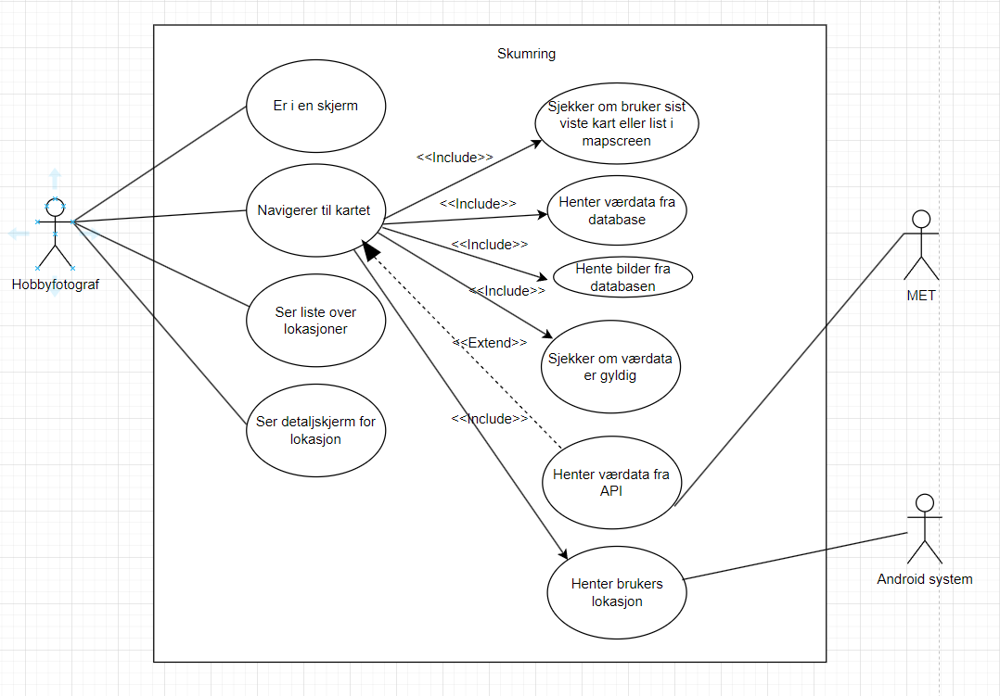
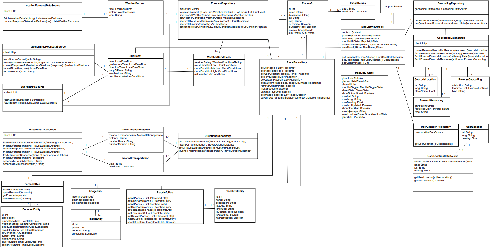
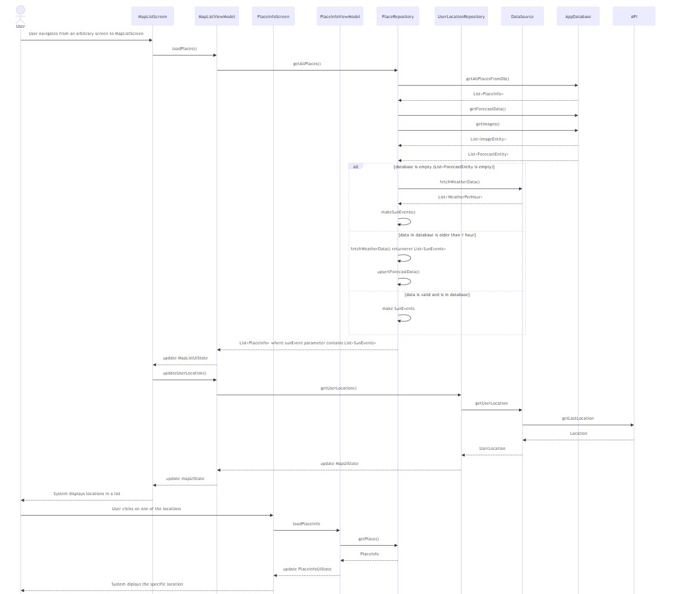
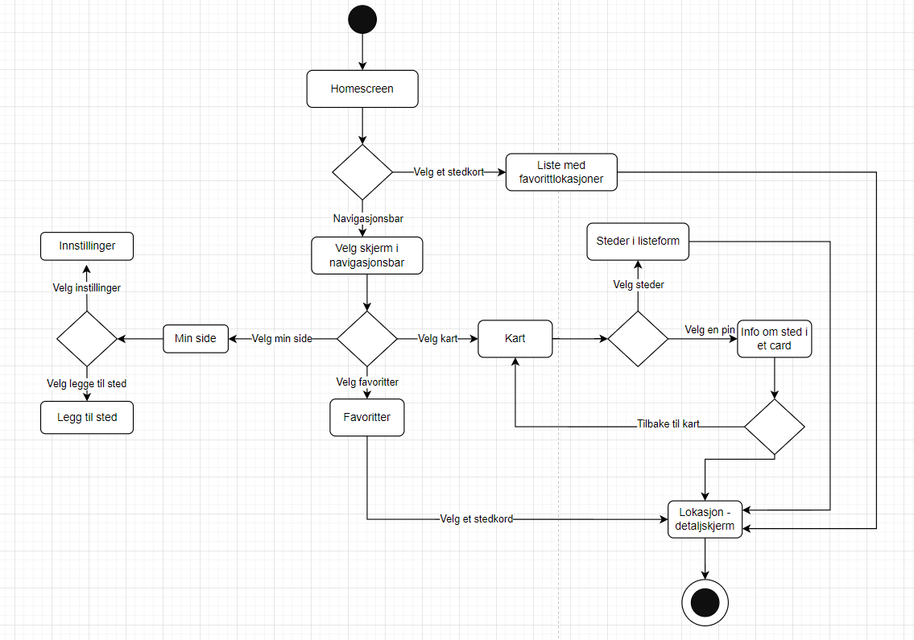

# Modellering

For use-caset har vi valgt: se informasjon om solnedgang og skydekke på lokasjon x

Det finnes mange måter å modellere denne casen.
Når bruker ønsker å se detaljer på en gitt lokasjon, må en navigere til en PlaceInfoScreen/detaljskjerm. Dette kan gjøres på følgende måter:
- Bruker kan navigere via Kart (MapListScreen) i navigasjonsbar. i denne skjermen kan bruker både se lokasjoner som pins på et kart,
og som en liste ved å trykke på togglebaren øverst på skjermen. Appen vil huske hvilken av disse to brukeren var på sist.
  - Det vil si: var bruker på kartet i MapListScreen, navigerer til Favoritter og så tilbake, 
  vil bruker se kart i MapListscreen. Var bruker i listen, navigerer til Favoritter og tilbake til MapListScreen,
  vil bruker se listen. Det er derfor vi har spesifisert dette i use-caset.
  - Bruker kan trykke på en pin. Da popper et lite kort opp, og bruker kan trykke på dette for å komme til en PlaceInfoScreen.
  - Bruker kan velge listen i togglebaren og vil da kunne trykke på ønsket lokasjon i listen. Da komm bruker til MapListScreen.
- Dersom bruker har lagt lokasjonen til som favoritt, kan bruker nå detaljer ved å trykke på Favoritter i navigasjonsbaren.
  Da vil bruker se disse stedene i en liste, og kan trykke på lokasjonen og bli før til PlaceInfoScreen.
  - Favoritter syns også på hjemskjermen, og bruker kan bla i denne listen og trykke på ønsket lokasjon. Da kommer
  bruker til detaljskjermen.
- Dersom bruker har lagt til denne lokasjonen selv, kan bruker navigere til Min side. Her er lokasjonene presentert 
i en liste. Bruker kan trykke på én av disse og så komme til detaljskjermen.

For å begrense caset har vi dermed følgende forhåndsbetingelser:
- bruker er på en vilkårlig skjerm i appen og vil navigere fra denne til en detaljskjerm/PlaceInfoScreen
- sist bruker var på MapListScreen, valgte bruker å se lokasjonene i listeformen, ikke i kartformat. Dette betyr ay ved å trykke på Kart i navigasjonsbaren vil lokasjonene presenteres i listeform.
- lokasjonen som bruker vil se eksisterer i appen, enten som en lokasjon de selv har lagt til eller lokasjonene
som fulgte med appen. Bruker trenger dermed ikke å legge inn lokasjonen.

Følgende diagrammer beskriver use caset fra ulike perspektiver.

## Use case diagram
Use case-diagrammet viser en bruker interagere med appeni henhold til usecaset.
 

## Klassediagram
Klassediagrammet viser alle objektene som er involvert for å finne og vise infoskjermen til lokasjon ved å navigere gjennom MapListScreen.
 

## Sekvensdiagram
Sekvensdiagrammet viser spesielt i denne use casen hvordan appen henter informasjon om brukers lokasjon og om værforholdene, slik at de kan displayes i infoskjermen til en gitt lokasjon. I vår app kalles nemlig på følgende funksjoner, som sjekker om værdata er gyldig (mindre enn én time gang), kommunikasjon med database og henting av brukers lokasjon. Vi har mange repositories og data sources som er involvert, men vi abstraherte datasourcen til ett objekt, og samlet alle API'ene i et API-objekt da det ble komplisert og uoversiktelig å definere alle disse objektene som ett i akkurat sekvensdiagrammet.
 

## Aktivitetsdiagram
Diagrammet viser generell flyt i appen. Ettersom use case vi bruker handler om at bruker skal komme seg til infoskjermen til en gitt lokasjon, er dermed slutten definert der hvor bruker har kommet seg frem til PlaceInfoScreen.
 

Et annet viktig use case er det hvor bruker ønsker å legge til en egendefinert posisjon. Caset kan utvides til at bruker så går inn på den nye lokasjonen enten via Min Side, eller ved å trykke seg inn via Kart i navigasjonsbaren. Fra disse skjermene kan brukerne trykke på lokasjonen enten via listen av lokasjoner i Min Side, eller via pin på kartet eller på kortet i listen på MapListScreen. 
Et annet use case er at en bruker markerer en lokasjon som favoritt, og ønsker å navigere seg inn på denne lokasjon enten via Favoritter i navigasjonsbaren eller via listen på hjemskjermen.
